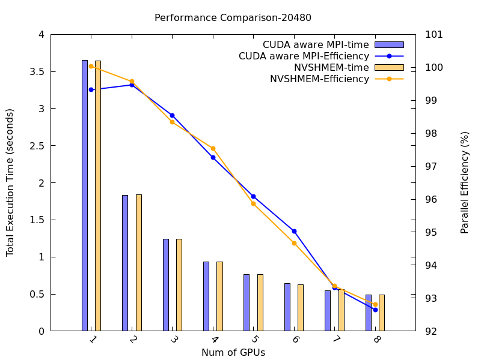
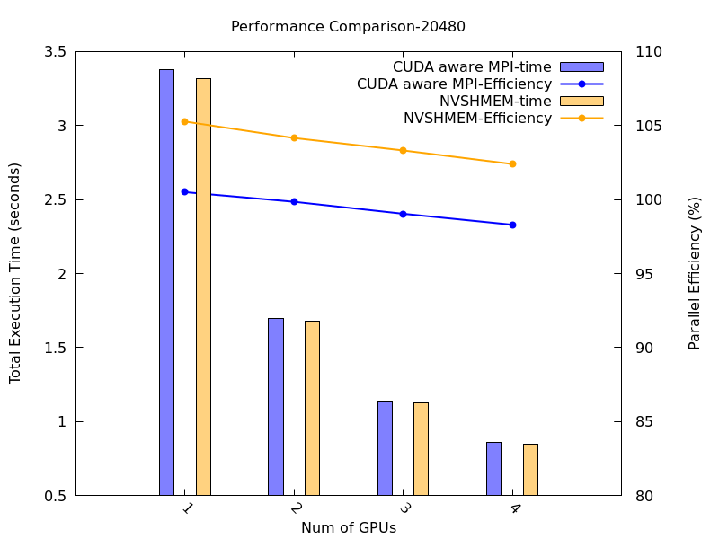
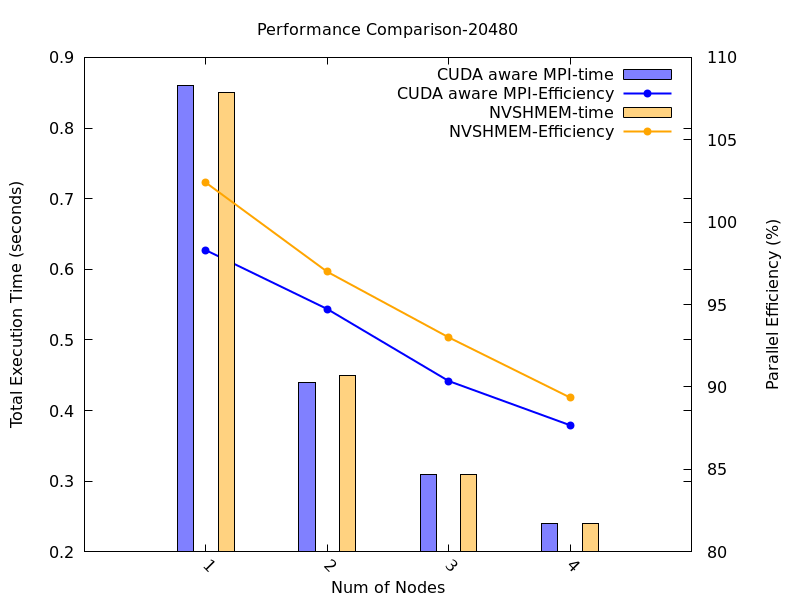

# Introduction
In this project, I aim to compare the performance of CUDA-aware MPI and NVSHMEM in scientific computation. I implement two algorithms: the Jacobi solver and the Lattice Boltzmann method, to measure their performance on ALEX, which features a node with 8 A100 40GB GPUs. I then port these algorithms to LEONARDO, which has 4 A100 40GB GPUs, and test them on a single node on ALEX and across 4 nodes on LEONARDO. The results indicate that CUDA-aware MPI still outperforms NVSHMEM.

# Results

## One node on ALEX

## One node on LEONARDO

### Single node performance

### Multiple node performance

### Speedup Comparison

**Speedup = T₁ / Tₙ**

where:  
- **T₁** is the *execution time on a single GPU* .  
- **Tₙ** is the *execution time on N GPUs*.  

| GPUs  | CUDA-aware MPI | NVSHMEM|
|-------|--------------|------------------|
| 4     | 3.96         | 3.90             |
| 8     | 7.68         | 7.37             |
| 12    | 10.90        | 10.71            |
| 16    | 14.08        | 13.83            |

More results are provided in the folder **results**.